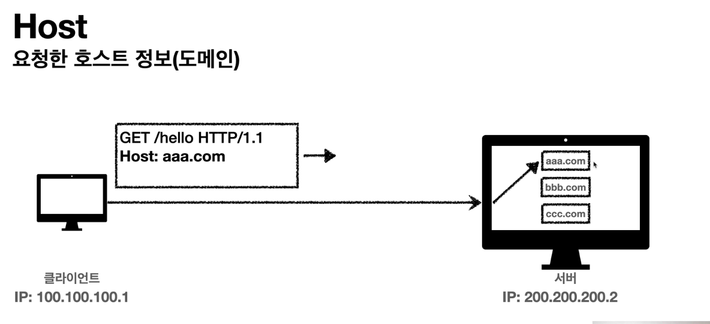

## Http Header
> Http 전송에 필요한 모든 부가정보.

- Http 헤더 > 표현 헤더 (데이터유형-html,json , 데이터 길이, 압축정보 등)
- 메시지 본문 (payload) > 표현데이터

###Representation 표현
> 데이터를 다양한 데이터 형식으로 표현하겠다. 해서 표현이라는 단어로 정의 하게 되었다.
> 
> ex) user 데이터를 html 로 표현 or json 으로 표현 등 

###협상
> 클라이언트가 선호하는 표현 요청
>
> 협상 헤더는 요청시에 사용가능.
> 

###전송방식
1. 단순 전송 
2. 압축 전송 
>Response : Content-Encoding header 에 압축방식 넣어줘야한다.
3. 분할 전송
>Response : Transfer-Encoding header 에 chunked 넣어줘야한다.
> 
> 미리 데이터를 받아서 사용 할 수 있다. 클라이언트에서 .
> 
> 브라우져가 알아서 처리 해준다.
4. 범위 전송 

####PRG 패턴 예시.
~~~
@Post("/회원가입")    
회원가입(회원, 에러정보) {     
   if (에러정보.에러가_존재하나요()) {
      // 회원가입 페이지로 이동, 유효성 검사를 진행 하여 문제 발생 여부 확인    
      return "회원가입 페이지"; 
   }   
   DB.save(회원);    
   // 회원을 저장하였다면 redirect를 하여 '/메인화면' 으로 이동하도록 구현
   return "redirect:/메인화면"; 
}
~~~

###일반 헤더
####Referer : 이전 웹 페이지의 주소
> 유입 경로 분석 가능.
>
####Server : 요청을 처리하는 ORIGIN 서버의 소프트웨어 정보.
>응답에서 사용.

####Host : 요청한 호스트 정보 (도메인)

>요청에서 사용 .
> 
> 하나의 서버에서 여러 도메인을 처리 해야할 때, 또는 하나의 IP 주소에 여러 도메인이 있을 경우 Host 로 구분.
####Location
>3XX 응답일 경우, Location 위치로 자동 리다이렉트 
> 
> 201 응답일 경우 생성된 리소스의 URI 
####Retry-After
>유저 에이전트가 다음 요청을 하기 까지 기다려야 하는 시간. (서버 점검 같은 거 할때 사용 가능.)

###쿠키
 - Set-Cookie 
>서버에서 클라이언트로 쿠키 전달 (응답)
 - Cookie
>클라이언트가 서버에서 받은 쿠키를 저장하고, HTTP 요청시 서버로 전달

####쿠키 미사용 
1. 모든 요청과 링크에 사용자 정보 포함? 
> 브라우저를 완전히 종료 하고 다시 열면? ;; 웹 스토리지 개념 등장.
#### 웹 스토리지 
>클라이언트에 데이터를 저장할 수 있도록 지원하는 HTML5의 새로운 기능
>
>쿠키보다 더 큰 저장공간을 가지고 있다.
 - 로컬 스토리지 
> 브라우저에 반 영구적으로 데이터를 저장. 
> 
> 브라우저를 종료해도 데이터가 유지된다.
>
> 도메인 (domain)이 다른 경우에는 로컬 스토리지에 접근할 수 없다. 예를 들어, www.google.com에서 로컬 스토리지에 저장한 데이터를 www.jiweon.com에서 접근할 수 없는 것과 같다.

 - 세션 스토리지 
>각 세션마다 데이터가 개별적으로 저장된다.
> 
> 예를 들어, 브라우저에서 여러개의 탭을 실행하면 탭마다 개별적으로 데이터가 저장되는 것이다.
> 
> 세션을 종료 하면 데이터가 자동 제거 된다. 
> 
> 같은 도메인이더라도 세션이 다르면 데이터 접근 불가.

####주의 할 점
>웹 스토리지를 사용할 때 주의해야 할 부분이 하나 있는데요. 오직 문자형(string) 데이터 타입만 지원한다는 것입니다.
>
>객체형 데이터 타입 저장 할때 주의.. 
> 
> 웹 스토리지를 사용할 때 위와 같은 문제를 피하기 위해서 많이 사용하는 방법으로 JSON 형태로 데이터를 읽고 쓰는 방법 존재.

#### 쿠키 사용 
> 브라우저는 요청을 보낼 때 쿠키저장소에서 쿠키 값을 찾아 모든 요청에 쿠키값 넣어 보낸다.
> 
 - 사용자 로그인 세션관리
 - 광고 정보 트래킹
####주의 할 점
 - 네트워크 트래픽 추가 유발
 - 최소한의 정보만 사용 (세션 id, 인증 토큰)
 - 보안에 민감한 데이터 저장 X .

####웹 스토리지에 토큰 저장 할 경우
 - 웹 스토리지에 저장된 값은 javascript 코드를 통해 언제든지 접근할 수 있는데, 
 이는 웹 사이트에 악의적인 스크립트를 넣어 의도하지 않은 동작을 발생시키는 XSS(cross-site scripting)공격에 취약합니다.
 - 구현이 간단합니다.
####쿠키에 토큰 저장 할 경우 
- 한정된 도메인에서만 사용이 가능함 
-> 토큰이 필요 해질 때 기존 토큰을 이용하여 새 토큰을 받아올 수 있도록 api 설계를 통해 해결
- CSRF 공격에 위험성이 생김  
-> CORS를 허용한 URL에서 보내는 요청이 아니면 막는 방법을 통해 해결

- 모바일 클라이언트들은  cookie store를 별도로 구현해야 되기 때문에 싫어 할 수 있다.

####쿠키의 종류 (생명주기)
>만료 시점을 기준으로 크게 두 가지로 나뉘며, 
> 
>브라우저가 종료되면 삭제되는 session cookies와 지정된 만료일에 삭제되는 persistent cookies가 있습니다.
#### Authorization 헤더와 토큰
> 질문 올림 
> 
> Authorization 헤더의 value는 <type> <credentials>처럼 생겨먹도록 하는 것이 표준이다.
> 
> 예시 : Bearer xmp98-cb35.potn6jz.zorj15gmb
1. Basic
> Basic은 ID와 비밀번호를 base64 인코딩하는 방식이다. base64는 별도의 key 없이도 복호화가 가능한 인코딩이므로, 안전하지 않다.

#### 쿠키의 접근
> Domain 과 Path 설정을 통해 쿠키에 대한 접근 설정 가능
> 
> Domain 명시 할 경우 해당 도메인과 서브 도메인까지 접근 가능.
> 
> 하지 않을경우 해당 도메인만! 접근 가능
> 
> 경로 지정 을 통해 해당 경로를 포함한 하위 경로 페이지 쿠키 접근 가능
> 
> 일반적으로 "/" 로 지정

####쿠키 보안
1. Secure
> Secure 적용시 https 인 경우에만 전송
2. HttpOnly
>XSS 공격 방지
> 
>HTTP 전송으로만 접근
3. SameSite
>XSRF 공격 방지
> 
> 요청도메인과 쿠키에 설정된 도메인이 같은 경우에만 쿠키 전송.

##추가 
###HTTPS
> HTTP 통신의 보안 취약점을 해결 하기 위해 SSL 또는 TLS 암호화 방식을 통해 보다 안전한 통신 가능.
> 
> HTTP 모든 내용을 암호화하는것이 아닌 Body 부분을 암호화 하여 전달.

####SSL & TLS
>SSL과 TLS는 모두 웹 서버와 사용자의 웹 브라우저 간 통신을 암호화 하는데 사용되는 프로토콜입니다.
>

###흐름 (SSL/TLS 통신)
1. 서버는 CA(인증기관)에게 해당 서버가 정상적인 서버임을 인증받기 위해 
 - 서버 본인의 공개키와, 사이트 정보 를 CA 에게 보냅니다.
 - 해당 인증기관에서 심사를 한뒤, 서버 공개키와 사이트정보에 대한 내용을 인증기관의 개인키로 서명합니다. -> 사이트 인증서 
 - 해당 인증서를 서버에게 보내줍니다.
2. 사용자가 인증서가 있는 서버에 접속하게 될 경우 ,
 - 서버에서 인증서를 사용자에게 전달 합니다.
 - 브라우저는 인증기관의 공개키 리스트를 가지고 있기 때문에 해당 공개키로 인증서를 해독한다.
 - 해독한 인증서 내에는 접속한 사이트의 정보와 공개키가 들어 있다.
 - 사용자는 자신의 대칭키를 접속한 사이트의 공개키로 암호화 하여 서버에게 보내준다.
 - 서버에서는 자신의 개인키로 접속한 사용자의 대칭키를 얻고 , 해당 대칭키로 암호화 하여 데이터 전달한다.

###Suwiki flow 정리 

