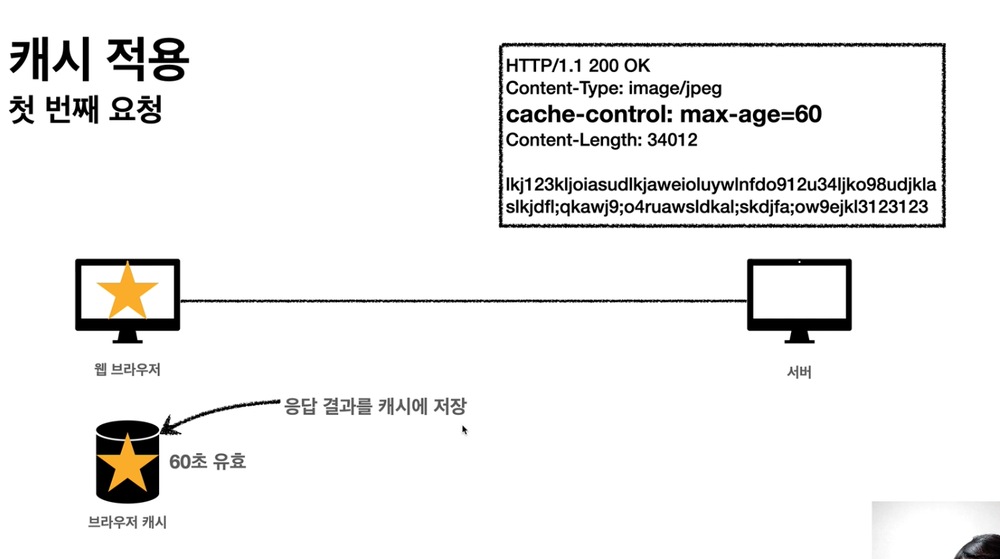
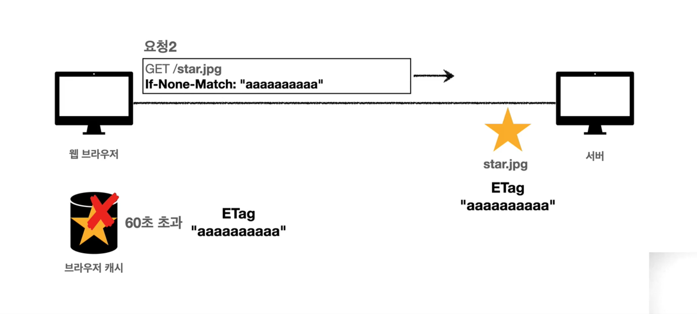
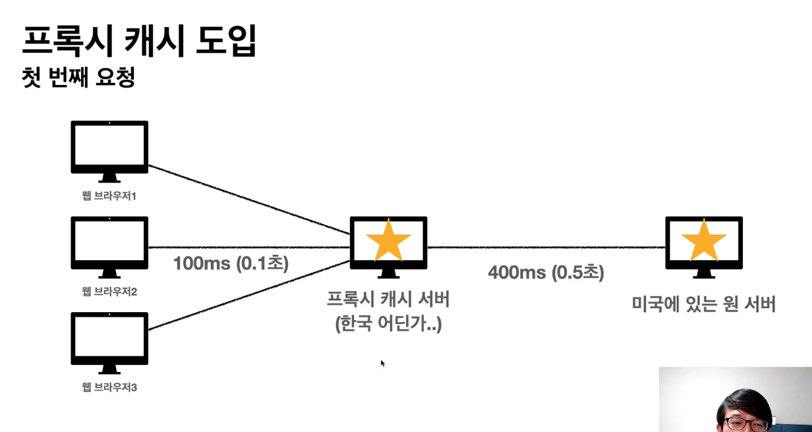

## Cache
### 자주 받아오는 데이터 또는 같은 데이터를 계속 받아올 경우 최적화를 할 수 없을까?
 - 데이터를 불러오기 위해
> 같은 요청이더라도 (header, body 동일) 데이터를 네트워크를 통해 매번 다운 받아야 한다. 
> 
> 메모리, 디스크 에 비해서, 인터넷 네트워크를 통한 통신은 느리고 비싸다.
> 
> 결국 이는 사용자의 불만으로 이어 질 수 있다. (브라우저 로딩 속도 저하로 인한.)

### 캐시 적용 

 - 브라우저는 요청할때 처음으로 브라우저 캐시를 찾는다.
 - 해당 요청 데이터가 캐시에 있다면 바로 가져온다. 
>인터넷 네트워크를 탈 필요가 없음

#### 캐시 시간 초과
> 서버를 통해 데이터 다시 조회 후 캐시 갱신 

#### 캐시 시간을 늘리면 안되나? 네트워크 비용 아낄수 있을텐데 ...
> 데이터 가 갱신되거나 어떤 변경이 일어났음에도 캐시 데이터를 오래 이용할 경우 최신화가 되지 않는다.
> 
> "신선하지 않다."
> 
> **그럼에도 불구하고 데이터 변경이 잘 일어나지 않는 데이터도 있읉텐데 뭔가 더 최적화 방법이 있지 않을까?**

#### 검증헤더를 통한 최적화 
> 나의 캐시에 있는 데이터와 서버의 데이터가 같은지 다른지 헤더를 통해 알 수 있다.
> 
> 같다면 캐시 데이터를 쭉 사용하고, 다르다면 캐시 갱신 하여 갱신된 데이터 사용 할 수 있다.
>
 - If-Modified-Since(조건부 요청 헤더), LastModified(검증 헤더)
   > 이후 데이터가 수정 되었는지 확인.
   - 데이터 미변경
   > 304 Not Modified (헤더 데이터만 전송)
   > 
   > 브라우저 캐시 저장소로 redirection.
   - 데이터 변경 
   > 200 OK , (모든 데이터 다 전송)
   >
   - 단점 
   1. 날짜 기반의 로직 사용.
   > 데이터를 수정 했지만 결과적으로 기존 데이터와 content 가 동일한 경우.
   > 
   > 이 경우에도 날짜 기반으로 검증하기 때문에 서버에서 다시 갱신.
   2. 서버에서 별도의 캐시 로직을 관리 하고 싶은 경우
   > 스페이스나 주석 처럼 크게 영향 없는 변경은 캐시 유지 할거야 등..
   > 
 - IF NONE MATCH (조건부 요청 헤더) , ETag (검증헤더) 이용
   >캐시용 데이터에 임의의 고유한 버전 이나 이름을 달아둠 .
   > 
   > 예 : ETag : "v1.0" 이나 해당 content 내용을 해쉬값으로 바꿔 이용.
 
   - 정리
   > 진짜 단순하게 ETag 만 서버에 보내서 같으면 유지, 다르면 다시 받기.
   > 
   >캐시 제어 로직을 서버에서 완전히 관리.
 
###캐시 제어 헤더
- Cache-Control
1. max-age 
> 캐시 유효시간, 초 단위 
2. no-cache
> 데이터는 캐시 해도 되지만, 항상 origin 서버에 검증 하고 사용.
> 
> 캐시를 쓰기전에 서버에 항상 검증하고 써라~
3. no-store
> 데이터에 민감한 정보가 있으므로 저장하면 안된다.

###프록시 캐시 도입
> 멀리 있는 origin 서버에 접근 할 경우 효과적으로 서비스 제공하기 위한 캐시.
>
> AWS 의 CloudFront , CDN 서비스

- public cache : 프록시 캐시 서버 (공용으로 사용하는 이미지나 동영상 , 유튜브)
- private cache : 사용자 local 캐시 (사용자 개인 정보, 사용자만 볼 수 있는 것들)

####Cache-Control 헤더
1. public : 응답이 public 에 저장 되어도 된다.
2. private : 응답이 사용자 만을 위한 것임. (기본값)
3. s-maxage : 프록시 캐시에만 적용되는 max-age

###Cache-Control 캐시 무효화 응답 (확실하게 무효화)
>Cache-Control : no-cache,no-store,must-revalidate

1. must-revalidate
>캐시 만료후 최초 조회시 원 서버에 검증 해야한다.
> 
> 원서버 접근 실패시 반드시 오류 발생 - 504
> 
> must-revalidate 캐시 유효시간이라면 캐시 사용.
